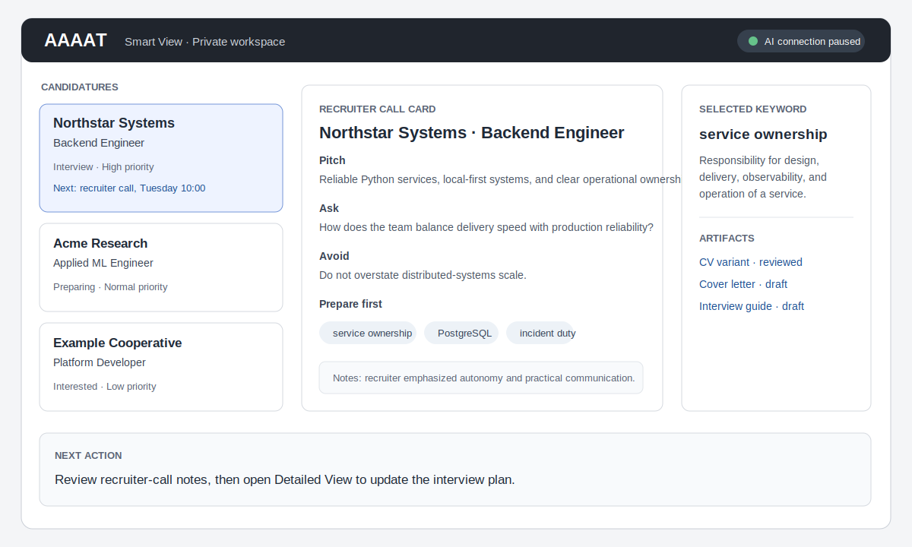

# AAAAT

AAAAT is a private desktop workspace for managing job applications, preparing recruiter and interview conversations, and producing candidature-specific application material.

It keeps the practical job-search record in one place: opportunities, source text, current stage, next actions, notes, professional context, research, form answers, CV and cover-letter material, and generated files.

AAAAT remains fully usable without an AI connection.

[](https://github.com/DidacLL/AAAAT/actions/workflows/ci.yml)
[](LICENSE)



## What AAAAT solves

A job search usually becomes fragmented across spreadsheets, notes, browser tabs, chat histories, documents, and provider-specific AI tools. AAAAT combines the operational tracker, reusable professional context, application preparation, local rendering, and optional external reasoning without turning the workspace into a cloud service or tying it to one model provider.

The candidature is the central unit of work. It connects the original offer, current status, next action, notes, research, evaluation, conversation preparation, generated text, and files already used for that opportunity.

## Core workflows

- Capture an offer, form, link, conversation, or manually entered opportunity.
- Save partial candidatures immediately; unknown facts remain empty.
- Use Smart View during recruiter calls for the essential context and live notes.
- Use Detailed View for complete inspection and editing.
- Maintain reusable skills, experience, preferences, constraints, and career direction in User View.
- Prepare recruiter calls, interviews, form answers, CV positioning, and cover-letter text.
- Render and retain local CV and cover-letter files with provenance.
- Track what is current, sent, or archived without imposing an approval workflow.
- Back up or move the private workspace independently from the application.

## Product principles

### Local ownership

The authoritative SQLite database and private artifacts live in a user-selected local workspace, separate from the installed application. AAAAT has no required cloud account, telemetry service, or hosted database.

### Complete manual operation

Every core tracking, editing, preparation, rendering, search, and backup workflow works without an LLM, network connection, terminal, Git installation, or source checkout.

### Fast operational views

Smart View is a compact recruiter-call and urgent-preparation cockpit. Detailed View carries the full candidature record. User View holds reusable professional context. Welcome View handles orientation, workspace selection, and direct entry into useful work.

### Provider-neutral assistance

AAAAT is not an LLM wrapper, chat client, MCP product, or agent orchestrator. The application owns local data, validation, rendering, artifacts, and bounded authority. An external LLM may provide research, extraction, evaluation, strategy, and writing through the connection method supported by its own host.

### Privacy by construction

A connected host receives only purpose-scoped context and a small bounded operation set. It does not receive general database access, workspace paths, repository access, arbitrary record browsing, internal identifiers as mutation handles, or desktop widget commands.

Privacy does not depend on a person reviewing every AI step. Valid bounded results are validated locally and applied directly to the intended records. Invalid results do not consume their task capability; a connected host receives a safe retryable error and may correct the same bounded result.

## Connect the AI you already use

Choose **Connect my AI** in AAAAT. The application prepares one self-contained request containing:

- the single installed skill named `AAAAT`;
- an opaque revocable connection capability;
- the exact local stdio/MCP launch command;
- the bounded tool schemas available to that host;
- watched-folder task/result exchange as the preferred fallback;
- tagged result text only for hosts that cannot generate files.

Copy the request and paste it into the AI host you already use. A local host that can launch the paired bridge may initialize it directly. A remote host must use a reachable transport or AAAAT's file exchange rather than claiming local access it does not have. AAAAT does not ask for provider credentials, API keys, model URLs, model names, or provider SDKs.

The paired bridge supports a deliberately small workflow: read connection status, open the desktop, start bounded profile work, create a candidature from supplied material, claim one prepared work item, and submit one schema-valid result.

For profile completion, every returned variable value is plain text. Lists, timelines, education, experience, skills, links and projects are flattened into readable strings. AAAAT reports the rejected field precisely and keeps the same task capability available when the host submits an invalid shape.

## Installation

Download the archive for your platform, extract it once, and open the application:

- Windows: `AAAAT.exe`
- macOS: `AAAAT.app`
- Linux: `AAAAT`

Normal use does not require Python or a terminal. On first launch, choose the private folder that will hold your workspace. See the [User guide](docs/user-guide.md) for operation, connection, backup, restore, and troubleshooting.

## Technical shape

```text
wx desktop
    ↕
explicit AAAAT services
    ↕
private SQLite workspace + local artifacts
    ↕ optional bounded tasks/results
external LLM host
```

The core uses Python and SQLite. wxPython supplies the desktop adapter. PyInstaller produces native Windows, macOS, and Linux packages. Core runtime dependencies are otherwise empty.

## Project status

AAAAT 1.0 is the current product line. Pull-request CI validates the supported Python versions and builds the runnable Windows, macOS, and Linux packages from the same source. Version tags publish the verified archives and SHA-256 checksums.

Development and contribution guidance is in [CONTRIBUTING.md](CONTRIBUTING.md). Security reports and private-data handling guidance are in [SECURITY.md](SECURITY.md).

## Documentation

- [Product definition](docs/product.md) — purpose, principles, behavior, value, and non-goals
- [User guide](docs/user-guide.md) — installation and normal operation
- [Architecture](docs/architecture.md) — implemented boundaries and data flow
- [Optional AI integration](docs/ai-integration.md) — pairing and bounded authority
- [Development](docs/development.md) — source layout and validation
- [Releasing](docs/releasing.md) — native build and publication process

`AGENTS.md` contains repository-development constraints only and is excluded from installed releases. The only installed LLM-facing instruction is `aaaat/SKILL.md`, whose skill name is `AAAAT`.

AAAAT is licensed under GPLv3 or later. See [LICENSE](LICENSE).
