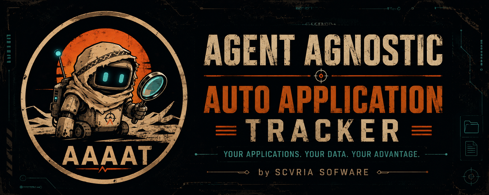

# Agent-Agnostic Auto Application Tracker

<p align="center">
  
</p>

AAAAT is a local-first job application workspace. It helps you track opportunities, prepare recruiter conversations, keep reusable profile material, and generate per-application artifacts such as CV variants and cover-letter drafts from your own local data.

AAAAT is built for one person running it on their own machine. Your job-search data lives in local storage by default, and the dashboard runs on localhost.

## What AAAAT does

AAAAT gives you a private operational dashboard for your job search:

- store job opportunities and raw offer text;
- track status, priority, next action, notes, keywords, and recruiter-call material;
- keep profile variables and reusable career facts for CVs and letters;
- render local CV and cover-letter artifacts from templates;
- keep generated artifacts with review state and provenance;
- export a static fake-data demo for sharing the project safely;
- expose optional bounded task/context surfaces for external tools or agents.

The dashboard can be used manually. External agent workflows are optional.

## Local-first privacy

Private data defaults to `.private/`.

Typical local layout:

```text
.private/
  aaaat.sqlite3
  artifacts/
```

Keep real job-search data in private local storage: raw offers, recruiter notes, profile values, CV content, generated letters, and backups. Static demos use fake data from `examples/demo_payload.json`, not your private database.

The dashboard binds to `127.0.0.1` by default. Do not run it as a public website.

## Installation

Requires Python 3.11 or newer.

Linux/macOS:

```bash
python -m venv .venv
source .venv/bin/activate
python -m pip install --upgrade pip
python -m pip install -e .
```

Windows PowerShell:

```powershell
py -3.11 -m venv .venv
.\.venv\Scripts\Activate.ps1
python -m pip install --upgrade pip
python -m pip install -e .
```

Check the command:

```bash
aaaat --version
```

You can also run AAAAT as a module:

```bash
python -m aaaat.cli --version
```

## Quick start

Initialize local storage, add one opportunity, and open the dashboard:

```bash
aaaat init
aaaat app create --company "Example Co" --role "Backend Engineer"
aaaat launch
```

Open the printed local URL, normally:

```text
http://127.0.0.1:8765
```

To use another private storage path, put `--storage` before the command:

```bash
aaaat --storage /path/to/private-aaaat init
aaaat --storage /path/to/private-aaaat launch
```

## Dashboard mode

Start the editable local dashboard:

```bash
aaaat launch
```

Use it to add opportunities, edit fields, paste raw offer text, manage tasks, add notes, and render artifacts.

## Read-only mode

Start the same dashboard without write controls:

```bash
aaaat launch --read-only
```

Use this for recruiter calls or review sessions when you want to inspect data without changing it.

## Agent mode

Start the bounded machine-facing runtime:

```bash
aaaat launch --agent-api
```

Agent mode is optional. It is for external tools that work through AAAAT task handles, task context, result submission, and purpose-scoped context bundles.

Useful commands:

```bash
aaaat agent tasks --state queued
aaaat agent next
aaaat agent context <task_handle>
aaaat agent packet <task_handle>
aaaat agent submit <task_handle> --result-file result.json
aaaat agent context-bundle --purpose cover_letter
aaaat agent action submit --input-file action.json
```

Descriptor commands:

```bash
aaaat mcp-descriptor
aaaat mcp-validate
```

## Artifact generation

Render a CV:

```bash
aaaat render cv --output .private/artifacts/cv.tex
```

Render a cover letter for an application:

```bash
aaaat render cover-letter <application_id> --body "Draft body pending review." --output .private/artifacts/cover-letter.tex
```

Track an artifact:

```bash
aaaat artifact save --application-id <application_id> --type cover_letter --path .private/artifacts/cover-letter.tex --label "Cover letter draft"
aaaat artifact list <application_id>
aaaat artifact update-state <artifact_id> --state reviewed --notes "Ready to use"
```

Review generated documents before sending them.

## Static demo export

Generate a standalone demo page from fake data:

```bash
aaaat export static-demo outputs/static-demo.html
```

The static demo is safe for showing the product shape because it uses fake demo data and has no backend write flow.

## Local data and backup

Back up AAAAT by copying the full private storage directory while the app is stopped:

```bash
cp -a .private ~/private-backups/aaaat/private-$(date +%Y%m%d-%H%M%S)
```

Restore by stopping AAAAT and copying the backup back to `.private/`, or by launching AAAAT with `--storage` pointed at the restored directory.

## More docs

- [Install](docs/install.md)
- [Local data and backup](docs/local-data.md)
- [Agent workflow](docs/agent-workflow.md)
- [CLI reference](docs/cli.md)
- [Security model](docs/security-model.md)
- [MCP descriptor notes](docs/mcp.md)
