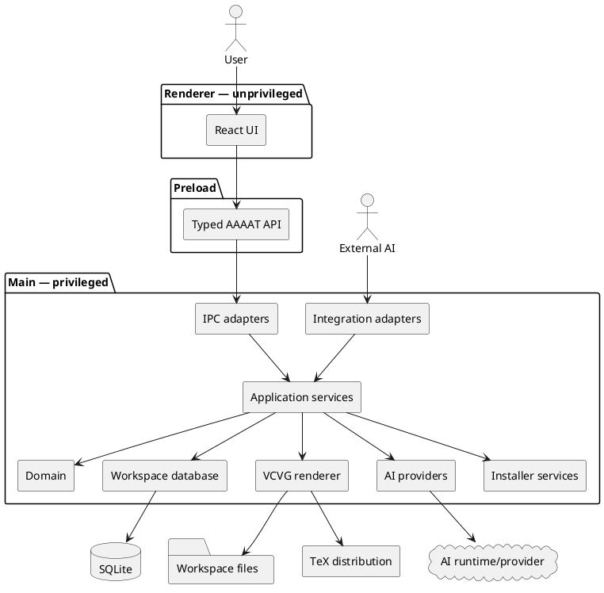
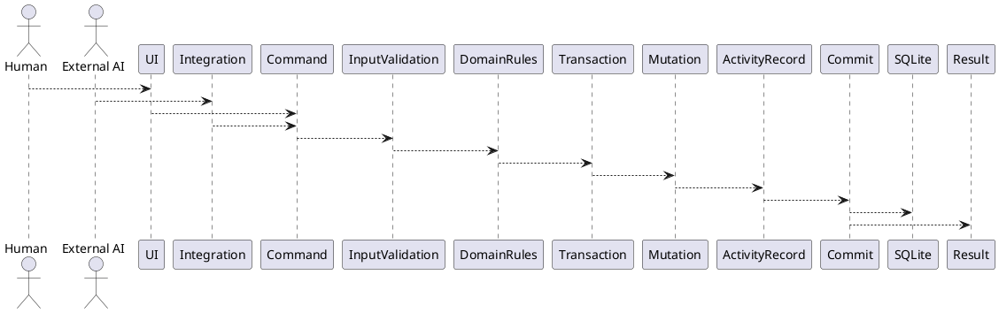

## Method

> **Status: Normative architecture and agentic-development master guide**
>
> This section defines how AAAAT v2 is to be built. Development agents may choose ordinary implementation details inside an assigned work package, but they must not reinterpret these architectural decisions without an accepted ADR.

### 1. Architectural objective

AAAAT v2 is one local desktop application with four cooperating capabilities:

```text
Candidature management
Profile / career knowledge
VCVGenerator
AI interoperability
```

They share one application core and one local workspace.

AAAAT must not become:

```text
a collection of independent applets
a workflow engine
an AI-agent framework
a plugin platform
a cloud service
a local microservice system
```

The architectural north star is:

```text
Human / external integration
          ↓
     bounded command
          ↓
   application service
          ↓
 validated domain change
          ↓
 SQLite + local artifacts
```

AI assistance adds one controlled branch:

```text
AAAAT user intention
        ↓
operation definition
        ↓
minimum required context
        ↓
privacy projection
        ↓
configured ModelProvider
        ↓
typed validated result
        ↓
normal AAAAT command
```

VCVGenerator follows:

```text
canonical career data
        ↓
profile variant
        ↓
document-specific overrides
        ↓
editable document model
        ↓
portable LaTeX project
        ↓
chosen standard TeX engine
        ↓
local PDF
```

No feature should require an additional architectural layer unless an actual requirement demonstrates that the existing flows cannot support it.

---

### 2. Sources of truth and precedence

Development agents must resolve conflicting information in this order:

```text
1. SPEC.md
2. accepted ADRs
3. canonical schemas/contracts
4. assigned work-package specification
5. acceptance tests
6. implementation
7. AAAAT v1 / AgenticCareerBoost historical evidence
```

AAAAT v1 and AgenticCareerBoost are **research sources, not implementation authorities**.

AgenticCareerBoost is specifically valuable as evidence for document portability. Its current CV workflow uses `pdfLaTeX`/`latexmk`, keeps the source together in a normal TeX directory, and explicitly allows the canonical `.tex` root to be compiled directly from that directory in a LaTeX IDE. AAAAT v2 must preserve and generalize this property. citeturn936537view0

The owner requirements remain product authority, particularly regarding manual UX, VCVG, privacy, broad AI interaction and the shared installation harness. fileciteturn0file0

---

### 3. Technology baseline

Initial v2 development will use:

| Concern | Decision |
|---|---|
| Desktop | **Electron 44 line** |
| Renderer | **React 19.2** |
| Language | **TypeScript 6 strict mode** |
| Build | **Vite 8 line** |
| Packaging | **Electron Forge** |
| Package manager | **npm** |
| Runtime schemas | **Zod 4** |
| Database | **SQLite through `node:sqlite`** |
| Unit/integration tests | **Vitest + React Testing Library** |
| Desktop smoke tests | **limited Playwright Electron tests** |
| Styling | **CSS Modules / ordinary CSS + design tokens** |
| LaTeX programming | **standard LaTeX + expl3** |
| Default LaTeX engine | **pdfLaTeX** |
| Additional LaTeX engines | **LuaLaTeX and XeLaTeX** |
| LaTeX build helper | **latexmk** |
| MCP | **official MCP TypeScript SDK v2** |

As of September 2, 2026, Electron 44 is the current stable major and embeds Node 24.19; React 19.2 is the current React release; TypeScript 6.0 is stable; Vite 8.1 is the current Vite line. citeturn989456search6 citeturn989456search2 citeturn939819search0 citeturn939819search3

Zod 4 is stable and provides first-party Zod → JSON Schema conversion. That is particularly useful because AAAAT can define a contract once and generate machine-readable schemas for IPC, AI structured outputs, integration harnesses and installer artifacts. citeturn427956search5 citeturn686539search0

Exact dependency versions are pinned when the repository is bootstrapped:

```text
package.json
package-lock.json
```

Agents must use the committed versions.

Normal feature work must never replace a dependency with `latest` or perform opportunistic dependency upgrades.

Dependency upgrades are isolated changes with their own verification.

---

### 4. Accepted build-tool risk

Electron Forge provides an official Vite + TypeScript template, but its Vite plugin remains classified as experimental and may introduce breaking changes in minor Forge releases. citeturn427956search0 citeturn427956search1

AAAAT accepts this risk because:

```text
Electron + React + TypeScript + Vite
```

is otherwise a strong fit.

Therefore the **first technical proof** must establish:

```text
development startup
production build
packaging
launch
preload IPC
node:sqlite access
```

on the supported operating systems.

Failure of the Forge/Vite integration may justify changing the build integration through an ADR.

It does **not** automatically justify replacing Electron, React, TypeScript or Vite.

---

### 5. Runtime architecture

AAAAT uses the standard Electron privilege boundary.



The renderer has no direct authority over:

```text
SQLite
filesystem
process execution
credentials
arbitrary networking
Electron main APIs
```

The BrowserWindow configuration must maintain:

```text
contextIsolation = true
sandbox = true
nodeIntegration = false
```

Electron recommends context isolation, process sandboxing, sender validation and narrowly exposing privileged APIs rather than exposing Electron itself to renderer code. citeturn989456search0 citeturn989456search1

No feature agent may weaken this boundary to make implementation easier.

---

### 6. IPC contract

The preload exposes explicit domain operations.

Example:

```ts
interface AAAATDesktopApi {
  candidatures: {
    list(query?: CandidatureQuery): Promise<CandidatureSummary[]>;
    get(id: string): Promise<Candidature>;
    create(input: CreateCandidatureInput): Promise<Candidature>;
    update(input: UpdateCandidatureInput): Promise<Candidature>;
    archive(id: string): Promise<void>;
  };

  profiles: {
    canonical(): Promise<ResolvedProfile>;
    variants(): Promise<ProfileVariantSummary[]>;
    getVariant(id: string): Promise<ProfileVariant>;
    saveVariant(input: SaveProfileVariantInput): Promise<ProfileVariant>;
  };

  documents: {
    list(query?: DocumentQuery): Promise<DocumentSummary[]>;
    get(id: string): Promise<ApplicationDocument>;
    create(input: CreateDocumentInput): Promise<ApplicationDocument>;
    update(input: UpdateDocumentInput): Promise<ApplicationDocument>;
    render(input: RenderDocumentInput): Promise<RenderResult>;
    exportProject(id: string, destination: string): Promise<ExportResult>;
  };

  ai: {
    connections(): Promise<AIConnectionSummary[]>;
    models(connectionId: string): Promise<ModelInfo[]>;
    run(input: AIRunInput): Promise<AIRunResult>;
    cancel(operationId: string): Promise<void>;
  };
}
```

The preload must never expose generic authority such as:

```ts
executeSql(...)
readAnyFile(...)
writeAnyFile(...)
spawn(...)
shell(...)
invoke(...)
fetch(...)
```

All IPC inputs and results use canonical Zod schemas.

The same schemas generate JSON Schema where external consumers require a portable contract.

---

### 7. Source structure

AAAAT remains a single product repository.

```text
src/
  core/
    candidatures/
    profiles/
    documents/
    concepts/
    activity/
    ai/
    integrations/
    installer/
    workspace/

  main/
    electron/
    ipc/
    database/
    filesystem/
    security/

  preload/
    index.ts

  renderer/
    app/
    features/
      candidatures/
      profile/
      vcvg/
      ai/
      settings/
      setup/
    components/
    styles/

  shared/
    contracts/
    schemas/

resources/
  latex/
    package/
    templates/

  installer/
    recipes/

  integrations/
    examples/

migrations/

generated/
  schemas/
  harness/

docs/
  SPEC.md
  adr/
  work/
```

A folder exists because it owns a real responsibility.

Agents must not create architecture-shaped folders such as:

```text
factories/
managers/
engines/
strategies/
repositories/
registries/
helpers/
utils/
```

without a concrete need.

---

### 8. Single mutation path

All durable mutations pass through application services.



The sequence is:

```text
validate
→ load current state
→ enforce rule
→ start transaction
→ mutate
→ record provenance/activity
→ commit
→ notify
→ return result
```

The following may never write database tables directly:

```text
React components
AI providers
MCP tools
installer recipes
integration adapters
LaTeX renderer
```

This rule prevents the multiple competing mutation paths that complicated AAAAT v1.

---

### 9. SQLite strategy

AAAAT retains SQLite as the workspace source of truth.

Electron 44 embeds a Node version with `node:sqlite`. Node's current API provides prepared statements, synchronous local database access and native SQLite backup functionality. citeturn989456search4

AAAAT therefore initially uses:

```ts
import { DatabaseSync } from "node:sqlite";
```

rather than a native third-party SQLite addon.

Reasons:

```text
no Electron ABI rebuild
no native-addon packaging layer
fewer moving pieces
sufficient functionality for AAAAT
```

`node:sqlite` is isolated behind one small database adapter because its current Node 24 documentation still labels the API release-candidate stability. citeturn989456search4

No ORM is introduced.

SQL should remain visible and auditable.

Database startup configures:

```sql
PRAGMA foreign_keys = ON;
PRAGMA journal_mode = WAL;
PRAGMA busy_timeout = 5000;
PRAGMA synchronous = NORMAL;
```

Tables use `STRICT` where practical.

---

### 10. Migration rules

Schema evolution uses immutable numbered SQL migrations.

```text
migrations/
  001_initial.sql
  002_add_...
  003_add_...
```

AAAAT records:

```sql
CREATE TABLE schema_migrations (
    version     INTEGER PRIMARY KEY,
    name        TEXT NOT NULL,
    sha256      TEXT NOT NULL,
    applied_at  TEXT NOT NULL
) STRICT;
```

Once merged, an existing migration is not edited.

Changes require another migration.

There is **no AAAAT v1 migration path**.

---

### 11. Initial domain model

The database models product concepts, not AI workflow machinery.

Core tables:

```text
profile_items
profile_variants
profile_variant_rules

candidatures
candidature_sources

concepts
candidature_concepts

documents
document_item_rules
artifacts

ai_connections
ai_operations

activity
integration_configs
workspace_settings
```

There is no generic durable `tasks` table.

If a future operation genuinely needs durable resumable background execution, that need must be demonstrated before introducing such infrastructure.

---

### 12. Canonical profile data

Professional information is represented as independently identifiable profile items.

Conceptually:

```ts
type ProfileItemKind =
  | "identity"
  | "contact"
  | "summary"
  | "experience"
  | "education"
  | "project"
  | "skill"
  | "certification"
  | "language"
  | "link"
  | "custom";
```

Each kind has its own Zod payload schema.

The physical table may use validated JSON for the subtype payload:

```sql
CREATE TABLE profile_items (
    id              TEXT PRIMARY KEY,
    kind            TEXT NOT NULL,
    label           TEXT NOT NULL,
    data_json       TEXT NOT NULL,
    tags_json       TEXT NOT NULL DEFAULT '[]',
    ai_policy_json  TEXT NOT NULL DEFAULT '{}',
    sort_order      INTEGER NOT NULL DEFAULT 0,
    created_at      TEXT NOT NULL,
    updated_at      TEXT NOT NULL,
    archived_at     TEXT
) STRICT;
```

This is deliberate polymorphic data, not an excuse to put the entire application into JSON.

Fields that must be queried relationally remain relational.

---

### 13. Profile variants

The canonical profile is authoritative.

Variants describe **focus**, not another person.

Examples:

```text
Software Architecture
Backend / Platform Engineering
AI / ML Engineering
Technical Product / Operations
Academic / Research
```

A variant has:

```text
stable ID
human-readable name
description
target tags
preferred language
optional document defaults
optional PDF metadata overrides
item visibility rules
item content overrides
item ordering
```

It stores only differences from canonical data.

Resolution:

```text
canonical profile
      ↓
variant include/exclude/override/order
      ↓
effective profile
```

An AI may recommend an existing variant by ID.

It cannot silently manufacture an unidentified copy of the profile.

Example AI result:

```json
{
  "recommendedProfileVariantId": "backend-platform",
  "confidence": 0.87,
  "reason": "The offer emphasizes APIs, platform ownership and distributed systems."
}
```

AAAAT validates the ID before presenting the recommendation.

---

### 14. Document-specific overrides

A document can specialize a profile variant further.

```text
canonical item
    ↓
variant rule
    ↓
document rule
    ↓
effective document data
```

Therefore:

```text
canonical profile ≠ duplicated CV database
profile variant   ≠ copied profile
document           ≠ mutation of profile
```

A targeted CV can omit projects, emphasize a particular experience or alter a summary without corrupting the reusable profile.

---

### 15. Candidature model

A candidature owns a job-search opportunity.

Initial lifecycle states must remain small and understandable:

```text
considering
preparing
applied
interviewing
offer
accepted
rejected
withdrawn
closed
```

Archiving is independent from lifecycle state.

A candidature may own:

```text
company
role
location
work mode
salary text
source URL
raw source material
summary
notes
status
dates
next action
concepts/tags
analysis
documents
artifacts
```

Missing fields remain valid.

A candidature is useful immediately after pasting only a job description.

---

### 16. Concepts and shared recruiter knowledge

Technologies, domain concepts, role keywords and useful definitions are shared entities rather than duplicated strings.

```text
Concept
  name
  type
  aliases
  definition
```

A candidature associates a concept with:

```text
relevance
context
notes
source
```

The live-meeting/focus view is a projection over these existing records.

It is **not another domain model**.

---

# VCVGenerator Architecture

### 17. VCVG design principle

VCVGenerator must produce documents that belong to the user.

A generated LaTeX source must not depend on AAAAT remaining installed.

A user must be able to:

```text
locate the source
copy the source project
open it in TeXstudio / VS Code / another IDE
compile it manually
place it in another repository
adapt its preamble
use another compatible build workflow
```

This is a hard portability requirement.

AAAAT is a producer and manager of standard LaTeX projects, not a proprietary LaTeX runtime.

---

### 18. LaTeX language versus engine

AAAAT LaTeX implementation code uses:

```text
standard LaTeX
+
expl3
```

`expl3` is the programming layer.

It must not be confused with a TeX engine.

The LaTeX Project continues to maintain the `l3kernel` programming interface for regular LaTeX2e packages, and current LaTeX testing covers pdfTeX, XeTeX and LuaTeX. citeturn564895search1 citeturn564895search0

AAAAT does not use Lua as its document implementation language.

No Lua script is introduced unless a future concrete requirement cannot reasonably be implemented through portable LaTeX/expl3.

---

### 19. Engine policy

VCVG supports:

```text
pdfLaTeX
LuaLaTeX
XeLaTeX
```

with:

```text
default / baseline = pdfLaTeX
```

The reason for this baseline is **portability**.

The default AAAAT templates should be compilable in ordinary long-established LaTeX environments without requiring a user to replace an existing TeX workflow merely because AAAAT generated the file.

LuaLaTeX and XeLaTeX are capability extensions where appropriate.

They are not mandatory for an ordinary CV.

---

### 20. Portable common layer

The default architecture is:

```text
AAAAT document model
        ↓
portable aaaat.sty / expl3
        ↓
small engine-specific configuration
    ┌─────────┼─────────┐
 pdfLaTeX  LuaLaTeX  XeLaTeX
```

Initially, engine branches stay inside the package.

Conceptually:

```tex
\sys_if_engine_pdftex:T
  {
    % pdfTeX-compatible setup
  }

\sys_if_engine_luatex:T
  {
    % LuaTeX-specific enhancements
  }

\sys_if_engine_xetex:T
  {
    % XeTeX-specific enhancements
  }
```

Separate files such as:

```text
aaaat-pdftex.sty
aaaat-luatex.sty
aaaat-xetex.sty
```

must **not** be created until the engine-specific code is substantial enough to justify them.

---

### 21. Multilingual documents

Multilingual support is implemented through standard LaTeX mechanisms.

Babel currently supports LaTeX running with pdfTeX, LuaTeX and XeTeX and provides localization support across a wide range of languages and scripts. citeturn574962search6

Therefore multilingual support does not automatically imply LuaLaTeX.

For ordinary Latin-script AAAAT use cases such as:

```text
English
Spanish
Catalan
French
German
Portuguese
Italian
```

the default templates must remain pdfLaTeX-compatible.

When a requested language/template requires capabilities outside the selected engine, AAAAT reports the compatibility issue and recommends an appropriate engine.

---

### 22. Enhanced Unicode/font capabilities

Some requirements genuinely need another engine.

`fontspec`, for example, provides OpenType/AAT font support specifically for XeLaTeX and LuaLaTeX. citeturn574962search4

AAAAT therefore treats capabilities separately from engines.

Example:

```ts
type LatexCapability =
  | "basic-latex"
  | "unicode-source"
  | "opentype-fonts"
  | "complex-script-shaping";
```

A template manifest can declare:

```json
{
  "supportedEngines": [
    "pdflatex",
    "lualatex",
    "xelatex"
  ],
  "preferredEngine": "pdflatex",
  "requiredCapabilities": [
    "basic-latex"
  ]
}
```

A specialized Arabic/OpenType template could instead require:

```json
{
  "supportedEngines": [
    "lualatex",
    "xelatex"
  ],
  "preferredEngine": "lualatex",
  "requiredCapabilities": [
    "opentype-fonts",
    "complex-script-shaping"
  ]
}
```

This keeps engine restrictions local to the document that actually needs them.

---

### 23. XeLaTeX position

XeLaTeX remains an AAAAT compatibility target because users may already have XeLaTeX-based environments.

However, AAAAT should avoid designing new advanced functionality that depends uniquely on XeTeX.

The LaTeX Project currently continues to test XeTeX but has stated that new upstream functionality is increasingly focused on LuaTeX, with XeTeX support becoming more best-effort. citeturn564895search0

This does not make XeLaTeX unsuitable for ordinary AAAAT document portability.

It simply means AAAAT should not make XeTeX the architectural foundation.

---

### 24. Engine selection UX

Most users should never have to choose an engine.

Selection follows:

```text
document explicitly selects engine?
        yes → validate and use it
        no
        ↓
template has preferred engine?
        yes → use preferred engine
        no
        ↓
pdflatex
```

If incompatible:

```text
Selected template requires OpenType fonts.

Current engine:
  pdfLaTeX

Compatible:
  LuaLaTeX
  XeLaTeX

[Use LuaLaTeX] [Change template]
```

Advanced users may explicitly configure the engine.

AAAAT never silently changes document-engine semantics behind the user.

---

### 25. Template compatibility contract

Built-in general templates must pass CI compilation using:

```text
pdflatex
lualatex
xelatex
```

unless a template manifest explicitly declares a narrower capability requirement.

Most AAAAT built-in templates should target all three.

Any new default template that stops compiling under pdfLaTeX requires an ADR explaining why the portability baseline is no longer appropriate.

---

### 26. LaTeX project structure

Every VCVG document owns a normal source project.

Example:

```text
documents/
  backend-example-cv/
    source/
      main.tex
      aaaat.sty
      aaaat-content.tex
      preamble.tex
      assets/

    output/
      main.pdf

    manifest.json
```

Exact filenames may evolve, but the following rule does not:

> **No generated LaTeX project may require source files outside its own project directory except standard packages from the user's TeX installation.**

Absolute paths into:

```text
AAAAT installation
workspace internals
developer repository
temporary directories
```

are forbidden.

---

### 27. Direct external compilation

The main `.tex` file must compile from its own source directory using ordinary tools.

For example:

```bash
pdflatex main.tex
```

or:

```bash
latexmk -pdf main.tex
```

or the corresponding Lua/Xe configuration.

`latexmk` is a build convenience, not an AAAAT-specific compiler. It currently supports automated LaTeX document generation and ships through both TeX Live and MiKTeX. citeturn574962search0

A user may ignore `latexmk` and compile manually.

---

### 28. LaTeX export

VCVG exposes:

```text
Open source folder
Open PDF
Copy source path
Copy output path
Export LaTeX project
```

`Export LaTeX project` copies everything necessary for independent compilation.

The exported directory must therefore be suitable for:

```text
another local folder
Git repository
USB/device transfer
TeX IDE
Overleaf-style project import
manual modification
```

No AAAAT runtime files are required after export.

---

### 29. Template architecture

The initial VCVG implementation ships a small number of templates.

A template is data/resources, not executable application code.

Example:

```text
resources/latex/templates/default-cv/
  template.json
  main.tex
  preamble.tex

resources/latex/templates/default-letter/
  template.json
  main.tex
  preamble.tex

resources/latex/templates/default-combined/
  template.json
  main.tex
  preamble.tex
```

The default `aaaat.sty` package contains reusable document logic.

The distinction is:

```text
aaaat.sty
    reusable AAAAT LaTeX API

template
    document layout/composition

document data
    user-specific content
```

---

### 30. Shared preamble support

VCVG must support the owner's requirement for reusable shared LaTeX configuration. fileciteturn0file0

The first implementation should use:

```text
aaaat.sty
+
template preamble
```

rather than immediately create a custom document class.

A future:

```text
aaaat.cls
```

is justified only if actual repeated class-level behavior demonstrates that a package plus templates is insufficient.

---

### 31. User-owned templates

Advanced users may eventually import their own template project.

A custom template declares a manifest such as:

```json
{
  "schemaVersion": 1,
  "id": "my-cv",
  "name": "My CV",
  "entrypoint": "main.tex",
  "supportedEngines": [
    "pdflatex",
    "lualatex"
  ],
  "preferredEngine": "pdflatex",
  "requiredPackages": [
    "babel",
    "geometry",
    "hyperref"
  ],
  "dataContractVersion": 1
}
```

AAAAT validates the manifest.

It does not execute arbitrary JavaScript from a template.

LaTeX itself is the extension mechanism.

---

### 32. Structured document model

AI never directly owns document structure.

A CV has a typed document model approximately equivalent to:

```ts
type CvDraft = {
  title?: string;
  summary?: string;

  experience: Array<{
    profileItemId: string;
    selected: boolean;
    heading?: string;
    bullets: string[];
  }>;

  projects: Array<{
    profileItemId: string;
    selected: boolean;
    bullets: string[];
  }>;

  skills: Array<{
    group: string;
    values: string[];
  }>;
};
```

Cover letters similarly contain structured fields:

```ts
type CoverLetterDraft = {
  recipient?: string;
  subject?: string;
  salutation?: string;
  paragraphs: string[];
  closing?: string;
};
```

The renderer turns these models into deterministic LaTeX.

---

### 33. AI must not generate arbitrary LaTeX by default

The normal AI document path is:

```text
profile + job
    ↓
AI proposes document content
    ↓
Zod validation
    ↓
editable AAAAT draft
    ↓
AAAAT LaTeX renderer
```

not:

```text
profile + job
    ↓
AI writes entire .tex project
    ↓
execute it
```

AI-generated arbitrary TeX introduces unnecessary:

```text
compilation instability
template drift
security risk
engine incompatibility
formatting variability
```

and undermines deterministic rendering.

Advanced users can manually edit TeX themselves.

---

### 34. Managed and manual TeX modes

Documents have:

```text
managed
manual_tex
```

In `managed` mode:

```text
AAAAT document model → generated TeX
```

AAAAT owns regeneration.

If the user modifies generated source directly, AAAAT must detect that the source no longer matches its last generated hash before overwriting it.

The user is then offered:

```text
Keep my TeX edits
Regenerate from AAAAT
Export my edited project
```

Choosing to preserve source edits changes the document to:

```text
manual_tex
```

AAAAT may continue to compile it but must not silently regenerate its source.

---

### 35. PDF metadata

PDF metadata is part of the resolved document configuration.

It may inherit from:

```text
canonical profile
      ↓
profile variant
      ↓
document
```

A different professional profile can therefore legitimately produce different:

```text
title
author
subject
keywords
language
```

without duplicating the user's career data.

---

# AI Architecture

### 36. Provider neutrality

AAAAT defines neutrality as:

> The core product does not depend on one AI provider, while AAAAT itself can communicate directly with compatible AI systems.

The domain never imports:

```text
OpenAI SDK concepts
Ollama types
LM Studio types
MCP model concepts
provider-specific request objects
```

---

### 37. ModelProvider contract

The application-facing abstraction remains deliberately small:

```ts
interface ModelProvider {
  health(): Promise<ProviderHealth>;

  listModels(): Promise<ModelInfo[]>;

  generateText(
    request: TextRequest,
    signal?: AbortSignal
  ): Promise<TextResult>;

  generateObject<T>(
    request: ObjectRequest,
    schema: ZodType<T>,
    signal?: AbortSignal
  ): Promise<T>;
}
```

Additional methods require a real AAAAT use case.

No generalized agent interface is introduced.

---

### 38. Initial direct providers

The initial direct connection architecture supports:

```text
Generic OpenAI-compatible HTTP
Ollama preset
LM Studio preset
```

Ollama currently exposes OpenAI-compatible endpoints and supports structured output with JSON Schema. citeturn105720search2 citeturn105720search0

LM Studio exposes OpenAI-compatible models, Responses and chat-completions endpoints and supports JSON-schema-constrained structured output. citeturn939819search10 citeturn939819search4

The Ollama and LM Studio presets primarily provide:

```text
known endpoint
detection
help text
capability defaults
```

They should reuse the generic provider wherever compatibility is sufficient.

---

### 39. No AI framework initially

AAAAT does not initially use:

```text
LangChain
LlamaIndex
agent frameworks
workflow orchestration frameworks
provider marketplaces
```

Initial provider communication should be understandable TypeScript built on the platform HTTP APIs.

A third-party AI SDK becomes justified only when measured provider-specific duplication is larger and harder to maintain than the dependency.

That decision requires an ADR.

---

### 40. AI operations are user intentions

AAAAT v1 exposed too many field-level AI task concepts.

V2 instead defines bounded user intentions.

Examples:

```text
job.extract
job.assess
profile.recommend
document.tailorCv
document.draftCoverLetter
concepts.extract
candidatures.summarize
```

Each operation owns:

```text
input schema
output schema
required context
privacy requirements
prompt/instruction
capability requirements
mutation policy
```

Example:

```ts
const JobExtractOperation = {
  id: "job.extract",
  requires: {
    structuredOutput: true
  },
  inputSchema: JobSourceSchema,
  outputSchema: ExtractedJobSchema,
  context: ["job-source"]
};
```

Agents must not create a generic field-action registry.

---

### 41. AI connection selection

No complex automatic router is required initially.

Resolution:

```text
explicit connection selected for operation
        ↓
otherwise saved preference for operation
        ↓
otherwise default connection
        ↓
validate required capabilities
```

If the selected connection cannot perform the operation:

```text
explain why
show compatible connections
allow user choice
```

AAAAT may recommend a provider/model but does not silently route sensitive data to a remote provider.

---

### 42. Structured AI changes

AI returns proposals.

It does not directly mutate the database.

For extraction:

```text
AI result
    ↓
Zod validation
    ↓
compare with current candidature
    ↓
proposed patch
```

Mutation rule:

```text
empty field + valid proposal
    → may fill

same existing value
    → no-op

different existing value
    → conflict shown to user

invalid result
    → no mutation
```

Related accepted updates are committed atomically.

---

### 43. Privacy projection

AI receives an intentionally constructed projection.

```text
operation
    ↓
required domain fields
    ↓
resolved profile/candidature
    ↓
field privacy rules
    ↓
omit / expose / tokenize
    ↓
AI context
```

The privacy projection occurs immediately before the provider request.

It does not mutate authoritative data.

---

### 44. Private value tokenization

Where a value is needed structurally but should not be shown to AI, AAAAT may substitute an opaque token.

Example:

```text
Real:
  didac@example.com

AI-visible:
  [[AAAAT_PRIVATE_3]]
```

The mapping remains local.

After validated AI generation:

```text
AI output
    ↓
validate allowed placeholders
    ↓
local rehydration
    ↓
editable local draft
```

The final PDF can therefore contain the real information without the model ever receiving it.

This is especially useful for:

```text
name
email
phone
address
specific company identifiers
other personally identifying fields
```

when the operation does not require their semantic value.

An external AI application already granted arbitrary screen/shell/filesystem access falls outside this privacy boundary, as recognized in the owner notes. fileciteturn0file0

---

### 45. Remote-provider disclosure

AAAAT classifies connections:

```text
local
remote
unknown
```

Before transmitting to a remote connection, the UI must make the remote boundary understandable.

Bulk candidature analysis is more privacy-sensitive than analysing one offer and must receive an explicit acknowledgement before the first such remote use.

---

### 46. AI operation persistence

AAAAT may record AI-operation metadata for:

```text
provenance
debugging
user history
failure diagnosis
```

It must not turn this into a generalized durable task system.

A normal AI operation is:

```text
start
stream/progress
complete / fail / cancel
```

If AAAAT exits during it, the operation may simply become interrupted.

No resume engine is required.

---

# External AI → AAAAT

### 47. Separate inference from external control

Two directions remain architecturally distinct:

```text
AAAAT → AI
AAAAT owns inference through ModelProvider

AI → AAAAT
external AI invokes bounded AAAAT capabilities
```

MCP belongs primarily to the second direction.

---

### 48. External capability contract

External integrations invoke the same application commands used by the renderer.

Example capabilities:

```text
profiles.list
profiles.get

candidatures.list
candidatures.get
candidatures.create
candidatures.update

documents.list
documents.create
documents.render

concepts.list
```

There is no:

```text
database.execute
shell.execute
filesystem.readAny
filesystem.writeAny
```

capability.

---

### 49. Initial interoperability mechanisms

AAAAT should provide a small set of stable mechanisms:

```text
MCP stdio
bounded command/CLI invocation
portable import capsule
copy/paste capsule as last fallback
```

A local HTTP bridge is **not required initially**.

It may be added when a concrete AI ecosystem requires HTTP and its authentication/security model has been explicitly designed.

This avoids starting a localhost service merely because it may someday be useful.

---

### 50. MCP

When implemented, MCP uses the official TypeScript SDK v2.

The current v2 line implements the MCP `2026-07-28` specification and is the stable SDK line. citeturn559629search4 citeturn559629search6

AAAAT must never recreate:

```text
JSON-RPC framing
protocol negotiation
stdio protocol handling
MCP schemas
```

by hand.

---

### 51. Adaptive bridge discovery

Unknown AI systems are not automatically unsupported.

AAAAT provides enough structured information for a capable external AI/coding agent to determine:

```text
what AAAAT can do
what integration mechanisms AAAAT accepts
what the AI host itself supports
how to connect the two
how to validate the result
```

The process is:

```text
unknown AI ecosystem
       ↓
read AAAAT integration harness
       ↓
inspect own available extension mechanisms
       ↓
select existing AAAAT mechanism
       ↓
generate/configure host-side integration
       ↓
validate
       ↓
user approval
```

The likely generated artifact lives in the **AI ecosystem**, not inside an AAAAT plugin runtime.

Examples might include:

```text
AI-host skill
AI-host app/plugin
MCP configuration
tool definition
script
command wrapper
host-specific connector
```

AAAAT therefore does not need a universal executable plugin framework.

---

### 52. Integration manifest

Known and generated configurations are described with one versioned contract.

Example:

```json
{
  "schemaVersion": 1,
  "id": "example-ai",
  "displayName": "Example AI",
  "direction": "ai-to-aaaat",

  "transport": {
    "kind": "mcp-stdio"
  },

  "capabilities": [
    "profiles.list",
    "candidatures.list",
    "candidatures.create",
    "documents.create"
  ],

  "permissions": {
    "readCareerData": true,
    "writeCandidatures": true,
    "renderDocuments": false
  }
}
```

Zod owns the canonical schema.

JSON Schema is generated from it.

Agents must not maintain a separate handwritten JSON Schema copy.

---

### 53. Generated bridge trust

AI-generated integration material starts as:

```text
proposed
disabled
```

Before activation AAAAT validates what it can:

```text
manifest validity
known capability names
transport compatibility
connection test
read/write permissions
test operation
privacy disclosure
```

Generated code or commands are not trusted because an AI wrote them.

---

# Installer / Configuration Harness

### 54. One installation knowledge source

The setup UI and AI setup harness must not contain separate installation truth.

Canonical source:

```text
resources/installer/recipes/
+
Zod schemas
```

Generated consumers:

```text
AAAAT setup UI
installer.ai
generated JSON schemas
```

Therefore:

```text
one source of truth
       ↓
 ┌─────┴─────┐
 UI        AI harness
```

---

### 55. Existing environments first

The installer must assume that technically experienced users may already have:

```text
MiKTeX
TeX Live
MacTeX
custom PATH configuration
preferred LaTeX IDE
local AI runtime
existing model servers
```

AAAAT must detect and validate before recommending replacement.

For LaTeX:

```text
detect pdflatex
detect latexmk
detect optional lualatex/xelatex
validate template packages
render smoke document
```

A working existing environment is accepted.

AAAAT must not force MiKTeX merely because it is the recommended beginner path.

---

### 56. Beginner installation path

For a user without LaTeX, setup offers a guided recommended choice.

Per the owner requirements, Windows may recommend MiKTeX as the initial simple option. fileciteturn0file0

The recipe system remains capable of representing alternatives.

Installer language should say:

```text
PDF rendering requires a LaTeX installation.

Recommended:
  Install MiKTeX

Already use LaTeX?
  Use existing installation
```

not:

```text
Install dependency X version Y using command Z
```

unless the user enters advanced detail.

---

### 57. Recipe model

Example:

```json
{
  "schemaVersion": 1,
  "id": "latex-windows-miktex",
  "platforms": ["win32"],
  "provides": ["latex"],

  "detect": [
    "pdflatex",
    "latexmk"
  ],

  "validate": [
    "render-default-pdflatex-document"
  ],

  "recommendation": {
    "kind": "guided-external-install",
    "product": "MiKTeX"
  }
}
```

Recipes reference known AAAAT actions.

They do not contain unrestricted generated shell programs.

---

### 58. `installer.ai`

`installer.ai` is a generated **text harness**, not executable source code and not the canonical configuration database.

It explains to an AI assistant:

```text
what AAAAT requires
what has already been detected
available installation recipes
allowed configuration operations
validation commands/actions
AI integration contracts
how to report success/failure
```

An AI may propose an alternative route for an unknown environment.

Generated shell commands require user visibility/approval before AAAAT executes them.

---

### 59. Initial setup completion

A complete setup can verify:

```text
workspace opens
database works
basic manual candidature works
selected TeX engine works
default CV test renders
default cover letter test renders
configured AI connection responds, if selected
```

AI remains optional.

Failure to configure AI does not make installation unsuccessful.

---

# Workspace, Artifacts and Security

### 60. Workspace structure

A workspace should remain understandable outside the database.

Conceptually:

```text
AAAAT/
  workspace.sqlite

  documents/
    ...

  artifacts/
    ...

  templates/
    ...

  integrations/
    ...

  exports/
```

Internal filenames may use IDs for reliability, but the UI always presents human-readable titles and paths.

---

### 61. Secrets

Credentials do not live as plaintext SQLite data.

Connection records contain:

```text
endpoint
model
capabilities
privacy mode
secret reference
```

The actual secret uses Electron `safeStorage` where secure OS storage is available.

Electron currently recommends the asynchronous `safeStorage` APIs and documents that protection semantics differ between operating systems; AAAAT must detect insecure/fallback conditions instead of pretending every platform offers identical guarantees. citeturn987323search0

If secure credential storage is unavailable:

```text
AAAAT explains it
does not silently persist sensitive credentials insecurely
```

---

### 62. Backup

Backup contains:

```text
SQLite backup
document projects
artifacts
templates/configuration
integration manifests
backup manifest
```

Secrets are excluded by default.

SQLite database backup uses the native backup API rather than byte-copying a live WAL database. Node's current SQLite API exposes that backup operation. citeturn989456search4

Restore validates:

```text
manifest
schema version
database integrity
paths
```

before activating the workspace.

---

### 63. Activity and undo

AAAAT records meaningful changes for provenance and reversible operations.

Example:

```text
entity
action
actor
before
after
timestamp
```

Actors include:

```text
human
ai
external-integration
system
```

This is **not event sourcing**.

SQLite remains authoritative current state.

Undo runs a normal application command that restores supported previous values and creates another activity record.

---

### 64. Cross-process changes

External AI integrations may open the same workspace from another process.

Local renderer mutations already generate normal internal change notifications.

When external-write integrations are enabled, AAAAT may use lightweight SQLite external-change detection instead of recreating v1's expensive full-state polling.

Any such mechanism must invalidate/reload actual affected queries rather than rebuild the whole UI periodically.

---

# Renderer Architecture

### 65. Information architecture

Initial top-level product areas:

```text
Candidatures
VCVGenerator / Documents
Profile
Settings
```

Setup is accessible from Settings and during first-run.

A candidature workspace can present:

```text
Overview
Focus
Source
Documents
```

These are projections over the same candidature.

There is no separate Smart/Detailed domain architecture.

---

### 66. Progressive disclosure

The UI must normalize incomplete data.

Instead of:

```text
40 empty fields
```

AAAAT should show:

```text
Company
Role
Status

+ Add location
+ Add salary
+ Add contact
+ Add notes
```

Advanced information appears when relevant.

This implements the owner requirement that manual users should not feel that a candidature is incomplete merely because they do not want to populate every possible field. fileciteturn0file0

---

### 67. Renderer state

Do not add Redux or another global-state framework initially.

State categories:

```text
server/domain state
    → queried through AAAAT API

local UI state
    → React component/hooks

small app state
    → React context when genuinely shared
```

There should be no duplicate renderer copy of the complete database.

Mutations return results and trigger invalidation of affected views.

If actual complexity later demonstrates the need for a dedicated state/query library, adoption requires a short ADR based on concrete pain rather than preference.

---

# Testing Architecture

### 68. Test principle

Tests protect:

```text
user behavior
domain invariants
security boundaries
data integrity
external contracts
portable artifacts
```

They must not freeze arbitrary implementation structure.

---

### 69. Core tests

Domain/application-service tests run without Electron UI where practical.

Required areas include:

```text
candidature lifecycle
profile resolution
variant resolution
document override resolution
privacy projection
AI patch conflict behavior
undo
database migrations
backup/restore
```

---

### 70. Renderer tests

React Testing Library tests user-observable behavior.

Examples:

```text
user can create a candidature with only company + role
empty optional fields do not dominate the screen
user can select another profile variant
AI conflict is shown without overwriting existing value
manual mode remains available when AI is offline
```

Tests should not assert internal component state or implementation-specific DOM structure unnecessarily.

---

### 71. AI contract tests

Provider adapters use deterministic fixture servers in CI.

Tests cover:

```text
health
model listing
text response
structured response
invalid JSON
schema mismatch
HTTP failure
timeout
cancellation
missing model
```

Real-model compatibility runs separately because model output is nondeterministic.

---

### 72. LaTeX portability tests

LaTeX portability is a CI contract.

For each built-in general template:

```text
generate representative source project
compile with pdfLaTeX
compile with LuaLaTeX
compile with XeLaTeX
verify PDF exists
verify source has no AAAAT-local absolute paths
```

A separate test copies the generated project to another temporary directory and compiles it there.

This proves that the project is genuinely portable rather than accidentally resolving files from the AAAAT source tree.

---

### 73. VCVG behavior tests

Required tests include:

```text
profile → variant resolution
variant → document override
multilingual content escaping
LaTeX-special-character escaping
private token rehydration
PDF metadata generation
managed source hash detection
manual_tex preservation
CV rendering
cover-letter rendering
combined rendering
```

---

### 74. Desktop security tests

Automated checks assert:

```text
nodeIntegration = false
contextIsolation = true
sandbox = true
preload API contains only allowlisted methods
IPC validates sender
IPC validates inputs
```

Electron specifically recommends sender validation and narrowly constrained privileged access. citeturn987323search2

---

### 75. Packaged smoke tests

Desktop automation is deliberately small.

Critical journeys:

```text
launch packaged app
create workspace
create candidature
restart
data still exists
render test document
open settings
```

Most renderer behavior belongs in faster renderer integration tests rather than driving Electron for every case.

---

# Agentic Development Contract

### 76. Purpose

Multiple AI development teams will work on AAAAT.

The documentation must therefore optimize for:

```text
unambiguous ownership
small context
explicit boundaries
machine-readable contracts
minimal architectural freedom
fast verification
```

rather than expecting every agent to rediscover the architecture.

---

### 77. Root agent instructions

The repository contains a short root:

```text
AGENTS.md
```

It must **not duplicate this entire specification**.

Its role is to tell an agent immediately:

```text
read SPEC.md
read your work package
read relevant ADRs
do not alter architecture outside scope
run required checks
```

It also summarizes the critical invariants.

SPEC remains authoritative.

---

### 78. Work-package format

Every agent team receives a bounded document:

```text
docs/work/WP-###-name.md
```

with:

```markdown
# Goal

# User-visible outcome

# In scope

# Explicitly out of scope

# Existing contracts to consume

# Contracts this package may create/change

# Expected areas/files

# Acceptance tests

# Manual verification

# Dependencies

# Completion evidence
```

An agent should be able to determine what **not** to implement before reading implementation files.

---

### 79. Vertical work packages

Prefer work packages that create one usable end-to-end capability.

Good:

```text
Create and persist a manual candidature

Resolve canonical profile + one variant

Render one portable CV project through pdfLaTeX

Connect to an OpenAI-compatible local endpoint

Extract job fields into a reviewable proposal
```

Bad:

```text
Build complete database layer

Build generalized AI infrastructure

Build frontend architecture

Create future plugin system
```

A vertical package can include UI, core, persistence and tests when those pieces together create the smallest coherent behavior.

---

### 80. Shared-contract ownership

Only one active work package owns a shared contract at a time.

Examples:

```text
database migration
IPC schema
AI operation schema
profile resolution contract
integration manifest
LaTeX template contract
```

Other parallel agents consume it.

They do not modify it opportunistically.

If another team needs a contract change, it proposes that change to the owning work package or creates an ADR/work-package dependency.

---

### 81. Safe parallelism

Good parallelism after contracts exist:

```text
Team A → candidature UI
Team B → LaTeX template/portability proof
Team C → generic AI adapter tests
```

Bad parallelism:

```text
Team A redesigns database
Team B redesigns IPC
Team C redesigns profile model
Team D builds features against assumptions about all three
```

Foundations require sequential contract stabilization.

Features can then parallelize.

---

### 82. Architectural prohibitions

An implementation agent may not silently add:

```text
ORM
Redux
general global-state framework
LangChain
LlamaIndex
agent framework
workflow engine
plugin framework
microservices
cloud backend
GraphQL
Docker runtime requirement
Kubernetes
generic repository framework
background daemon
v1 compatibility
handwritten MCP protocol
AI-generated arbitrary TeX pipeline
Lua dependency for ordinary VCVG templates
```

If an agent concludes one is needed, it must produce an ADR proposal rather than implementing the architectural change as incidental work.

---

### 83. Abstraction rule

Create an abstraction when at least one is already true:

```text
two actual implementations require one contract
security/process isolation requires it
third-party behavior must be isolated
business logic is duplicated
testing a critical boundary otherwise becomes impractical
```

Do not create one because:

```text
we may need it
it is scalable
clean architecture says so
the design pattern exists
another project uses it
```

Prefer:

```text
one clear function
```

over:

```text
interface
abstract class
factory
registry
manager
implementation
```

until genuine variation exists.

---

### 84. Dependency rule

The v1 zero-dependency principle is explicitly rejected.

A dependency is acceptable when it replaces more maintained complexity than it introduces.

A runtime dependency PR must state briefly:

```text
problem solved
why standard platform APIs are insufficient
maintenance/security impact
alternative considered
```

Small dependencies do not require ADRs.

Stack-level dependencies do.

---

### 85. No speculative scaffolding

Agents must not build unused infrastructure for future milestones.

Forbidden examples:

```text
empty provider registry for 15 future providers
unused event bus
plugin loader with no plugin
generic job scheduler with no durable job
template marketplace abstractions
multi-workspace server
unused REST layer
```

Future functionality begins when its work package begins.

---

### 86. Generated contracts

Where possible:

```text
Zod
    ↓
JSON Schema
    ↓
AI/tool/installer documentation
```

Generated files are marked as generated.

Agents edit the canonical schema, then regenerate.

They must not fix generated output manually.

---

### 87. Error handling

Errors crossing architectural boundaries use stable error codes.

Example:

```ts
type AAAATErrorCode =
  | "VALIDATION_FAILED"
  | "NOT_FOUND"
  | "CONFLICT"
  | "AI_UNREACHABLE"
  | "AI_MODEL_UNAVAILABLE"
  | "AI_INVALID_OUTPUT"
  | "AI_CANCELLED"
  | "LATEX_NOT_FOUND"
  | "LATEX_PACKAGE_MISSING"
  | "LATEX_COMPILE_FAILED"
  | "INTEGRATION_INVALID"
  | "SECRET_STORAGE_UNAVAILABLE";
```

UI wording remains user-oriented.

Agents must not expose raw stack traces or protocol errors as normal product messages.

---

### 88. Logging

Logs are diagnostic, not a second database.

Never log:

```text
API keys
complete private profiles
private token mappings
entire AI prompts by default
full job-search history
```

Development diagnostics may include sanitized metadata.

---

### 89. ADR requirement

An ADR is required before changing:

```text
desktop runtime
renderer framework
language
database technology
process/security boundary
core domain model
AI provider contract
external integration contract
LaTeX portability baseline
default TeX engine
installer knowledge model
```

ADR format:

```markdown
# Context

# Decision

# Consequences

# Alternatives rejected
```

Keep ADRs short.

Routine code choices do not deserve ADRs.

---

### 90. Completion definition

A work package is complete only when:

```text
required behavior exists
acceptance tests pass
existing relevant tests pass
TypeScript strict check passes
lint/format checks pass
generated contracts are current
no undocumented architecture change exists
manual workflow has been exercised
work-package evidence is recorded
```

“Build succeeds” is insufficient.

---

### 91. Agent drift test

Before completing a work package, the agent must ask itself:

```text
Did I add a concept not requested by this work package?

Did I introduce a second path for an existing operation?

Did I create infrastructure only for future work?

Did I duplicate a canonical schema or rule?

Did I make a generated LaTeX project more dependent on AAAAT?

Did I make manual operation depend on AI?

Did I expose provider/protocol concepts to normal users?

Did I weaken an Electron privilege boundary?

Did I preserve a v1 structure only because it already existed?
```

Any `yes` requires correction or explicit architectural justification.

---

### 92. Non-negotiable acceptance invariants

Regardless of implementation stage, the final architecture must preserve these invariants:

**Manual independence**

```text
No AI installed
→ core AAAAT and VCVG manual workflows still work.
```

**LaTeX independence**

```text
Export generated source project
→ copy elsewhere
→ compile in ordinary compatible LaTeX environment
→ AAAAT not required.
```

**Data ownership**

```text
No AAAAT cloud account
→ local workspace remains authoritative.
```

**AI isolation**

```text
Malformed AI result
→ authoritative data is not corrupted.
```

**Privacy projection**

```text
Hidden field
→ real value is removed/tokenized before provider invocation.
```

**Single mutation path**

```text
UI / MCP / CLI / import
→ same application-service rules.
```

**Renderer isolation**

```text
React renderer
→ no unrestricted filesystem/database/process authority.
```

**No v1 inheritance**

```text
Old code/test/schema requires an awkward design
→ old contract is discarded.
```

**Portable document engineering**

```text
Default VCVG template
→ pdfLaTeX-compatible
→ also verified against supported alternate engines.
```

---

### 93. Final architectural statement

AAAAT v2 should remain understandable as:

```text
┌────────────────────────────────────┐
│ React desktop experience           │
│                                    │
│ Candidatures                       │
│ Profile variants                   │
│ VCVGenerator                       │
│ AI-assisted actions                │
└────────────────┬───────────────────┘
                 │ typed IPC
┌────────────────▼───────────────────┐
│ AAAAT application core             │
│                                    │
│ commands · rules · schemas         │
└───────┬──────────┬──────────┬──────┘
        │          │          │
     SQLite       VCVG       AI
        │          │          │
        │      LaTeX project  │
        │          │          │
        │     pdfLaTeX        │
        │     LuaLaTeX        │
        │     XeLaTeX         │
        │                     │
        └──────── local ownership
```

External AI adds another entrance:

```text
AI host
   ↓
known/generated integration
   ↓
bounded AAAAT capability
   ↓
same application core
```

It does not create another AAAAT.

The document subsystem likewise does not create a proprietary rendering ecosystem:

```text
AAAAT helps create the LaTeX project
        ↓
the LaTeX project remains ordinary LaTeX
        ↓
the user can leave AAAAT and keep working
```

That portability principle is intentional: **AAAAT should make technical users more productive without making nontechnical users responsible for the technical mechanisms.**